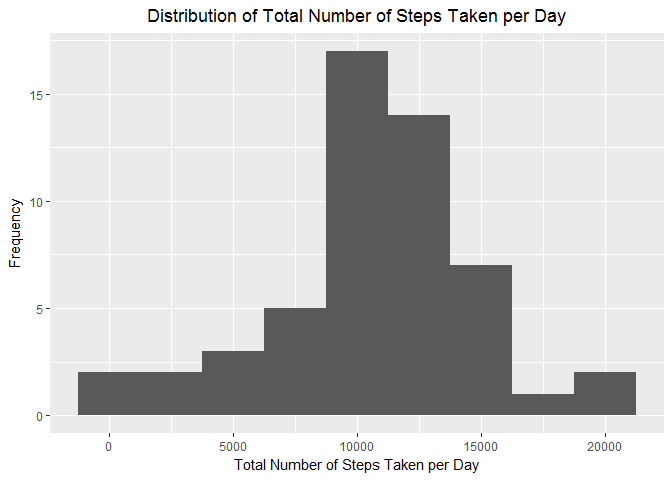
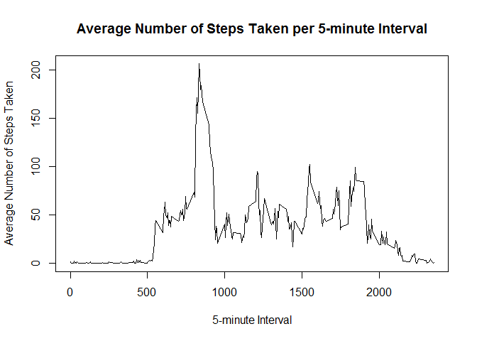
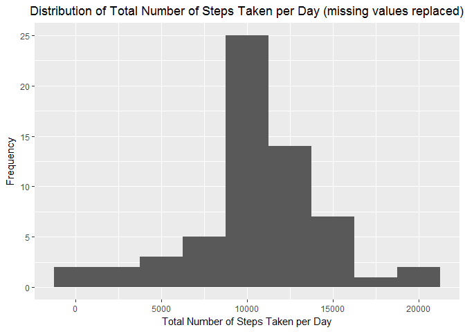

Loading and preprocessing the data
----------------------------------

    # Load the data assuming it is saved under its original name in the wording directory
    setwd("\\\\OAKSBS11/RedirectedFolders/guillaumebonnissent/My Documents")
    data <- read.csv("activity.csv", sep = ",", header = TRUE)

    # Convert date variable to date format
    data$date <- as.Date(data$date, "%Y-%m-%d")

What is mean total number of steps taken per day?
-------------------------------------------------

    # Create new dataset with no missing values (NB: missing values are for all 5-minute interval of one day)
    dateswithnodata <- unique(data[is.na(data$steps), ]$date)
    data2 <- data[!(data$date %in% dateswithnodata), ]
    # Calculate the total number of steps taken per day
    stepsperday <- tapply(data2$steps, data2$date, sum)
    # Make a histogram of the total number of steps taken each day using ggplot2 package with a class interval of 2,500
    library(ggplot2)
    qplot(stepsperday, binwidth = 2500, main = "Distribution of Total Number of Steps Taken per Day",
          xlab = "Total Number of Steps Taken per Day", ylab = "Frequency") + theme(plot.title = element_text(hjust = 0.5))

    # Calculate the mean of the total number of steps taken per day
    stepsmean <- mean(stepsperday)
    # Calculate the median of the total number of steps taken per day
    stepsmedian <- median(stepsperday)

The mean of the total number of steps taken per day is 1.076618910^{4},
and its median is 10765.

What is the average daily activity pattern?
-------------------------------------------

    # Calculate the average number of steps taken per 5-minute interval averaged across all days
    stepsmeanper5min <- tapply(data$steps, data$interval, mean, na.rm = TRUE)
    # Make a time series plot of the 5-minute interval (x-axis) by the average number of steps averaged across all days (y-axis)
    plot(x = names(stepsmeanper5min), y = stepsmeanper5min, type = "l",
         main = "Average Number of Steps Taken per 5-minute Interval",
         xlab = "5-minute Interval", ylab = "Average Number of Steps Taken")

    # Calculate the 5-minute interval with the maximum average number of steps taken
    maxsteps5min <- which.max(stepsmeanper5min)
    max5min <- names(maxsteps5min)

The 5-minute interval with the maximum average number of steps taken is
interval 835, during which an average of 104 steps were taken.

Imputing missing values
-----------------------

    # Calculate the total number of missing values in the dataset
    missingsteps <- sum(is.na(data$steps))

The total number of missing values in the dataset is 2304. A strategy to
replace those missing values is to replace them with the total average
number of steps taken per day but apportioned by 5-minute interval
according to the average number of steps taken by 5-minute intervals.

    # Calculate the average number of steps taken by 5-minute intervals for one day which would average the total average number of steps taken per day
    stepsmeanper5min2 <- stepsmeanper5min / sum(stepsmeanper5min) * stepsmean
    # Create a new dataset equal to the original dataset but with the missing values filled in
    data3 <- data
    for(i in 1:nrow(data3)) {
              if(is.na(data3$steps[i])) {
                        data3$steps[i] <- stepsmeanper5min2[names(stepsmeanper5min2) == data3$interval[i]]
              }
    }
    if(any(is.na(data3$steps))) {
              paste("There are still", sum(is.na(data2$steps)), "missing values")
    }

    # Calculate the total number of steps taken per day on the new dataset
    stepsperday2 <- tapply(data3$steps, data3$date, sum)
    # Make a histogram of the total number of steps taken each day using ggplot2 package with a class interval of 2,500 from the new dataset
    library(ggplot2)
    qplot(stepsperday2, binwidth = 2500, main = "Distribution of Total Number of Steps Taken per Day (missing values replaced)",
          xlab = "Total Number of Steps Taken per Day", ylab = "Frequency") + theme(plot.title = element_text(hjust = 0.5))

    # Calculate the mean of the total number of steps taken per day on the new dataset
    stepsmean2 <- mean(stepsperday2)
    # Calculate the median of the total number of steps taken per day on the new dataset
    stepsmedian2 <- median(stepsperday2, na.rm = TRUE)

As expected considering our strategy to replace missing values, the mean
of the total number of steps taken per day on the dataset with the
missing values replaced is the same (1.076618910^{4} against
1.076618910^{4} on the original dataset), and its median hasn't
materially changed (1.076618910^{4} against 10765).

Are there differences in activity patterns between weekdays and weekends?
-------------------------------------------------------------------------

    # Create a new factor variable in the dataset with two levels indicating whether a given date is a week day or weekend day in the dataset
    # with missing values filled in
    data3$day <- ifelse(weekdays(data3$date) %in% c("Saturday", "Sunday"), "weekend", "weekday")
    # Calculate the average number of steps taken per 5-minute interval and type of day, averaged across all days 
    databyweekday <- with(data3, aggregate(steps, by = list(interval, day), FUN = mean))
    names(databyweekday) <- c("interval", "day", "steps")
    # Make a panel plot containing a time series plot of the 5-minute interval (x-axis) and the average number of steps taken, averaged across all weekday days or weekend days (y-axis)
    ggplot(databyweekday, aes(interval, steps)) + geom_line() + facet_wrap(~ day, nrow = 2) + xlab("Interval") + ylab("Number of steps")

